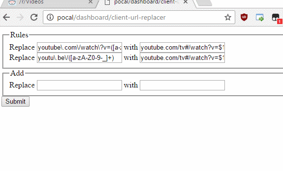
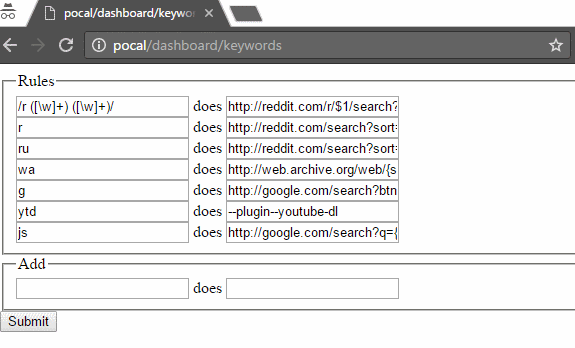
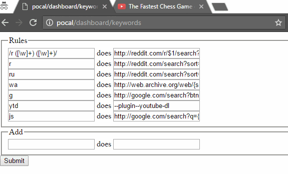

# pocal

Lets you control what happens when you click a link or search.

* Features (see below)
* [Technical details](docs/what-is.md)
* [Installation](install.md)
* [Basic setup](docs/basic-setup.md)
* [Creating a plugin](docs/creating-plugins.md)

## Feature #1: Client URL replacer

Specify a rule to replace the clicked URL into something else.

For eg., change a `youtube.com/watch` URL into `youtube.com/tv#` URL for a better, and lighter full-screen player:



## Feature #2: Keyword search

Specify you own keyword searches.

For eg., searching for `"r whatever"` takes you to reddit search results:



It also supports regex for advanced replace. Enclose regex in forward-slashes: `/xxx/`

For eg., `'/r ([\w]+) ([\w]+)/'` captures two positional groups which you can replace in: `'reddit.com/r/$1/search?q=$2'` to search in a specific subreddit.

Note: Whichever rule is matched first is executed first, so be sure to place more constrictive rules, like this regex rule, before more general rules, like the simple `'r'` rule as shown above.

## Feature #3: Plugins!

Make your own plugins to do advanced stuff.

In the target column put `'--plugin--<plugin-name>'`.

The `<plugin-name>` is looked for in the following locations:
```
../plugins/ (in this module dir)
~/.pocal/
~/.pocal/node_modules
../node_modules/ (in this module dir)
```

(also, this feature is currently only for keyword search, but planned for client-url-replacer as well)

It comes pre-loaded with a `youtube-dl` plugin, which uses [youtube-dl] to download ([most][sites]) videos.

[youtube-dl]: http://rg3.github.io/youtube-dl
[sites]: http://rg3.github.io/youtube-dl/supportedsites.html



